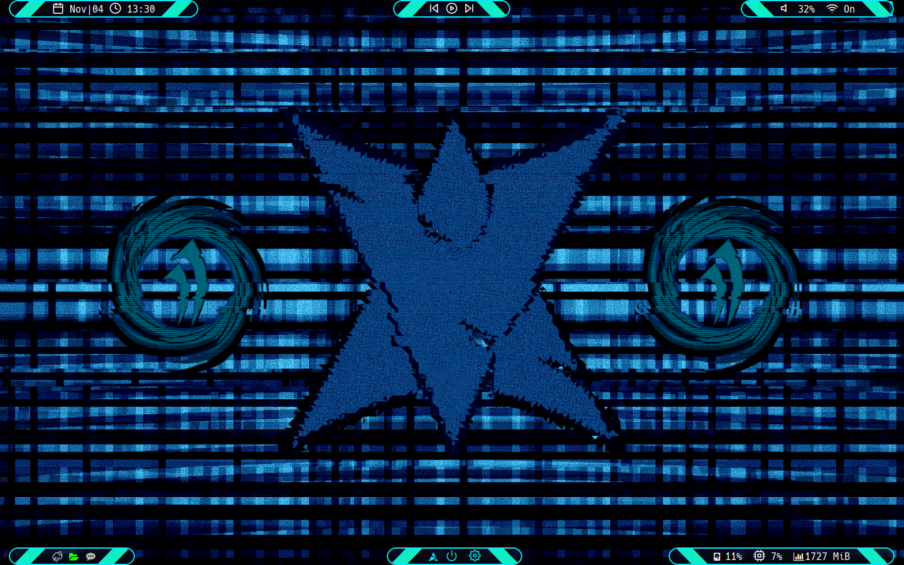
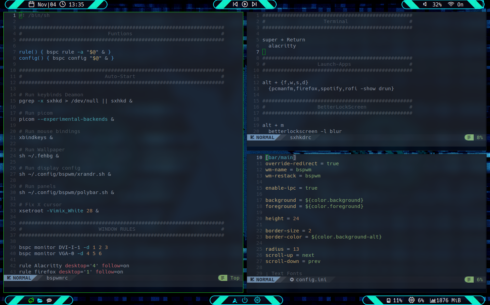

# Bspwm Dotfiles
my personal dotfiles for bspwm.

this dotfiles as made for two monitors of 1650x900 and 1440x900 so to dont get really compliced i 
erase the lines of the second monitor and problaly you may has to rescale all bars so good luck.

#### Examples

#### Install

> to use only clone the repo an move the files or only exec in a terminal this commands.

1. git clone https://github.com/cnapta/dotfiles.git.

2. mv config/ ~/.config.

3. mv local/ ~/.local.

4. mv misc/ ~/.

#### Apps 

- **DISTRO**: ARCH LINUX

- **Terminal**: Alacritty.
- **Editor**: Nvim/Lapce.
- **Music Player**: Spotify.
- **Browser**: Firefox.
- **Window Manager**: BSPWM & SXHKD.
- **Bars**: Polybar.
- **Transparent and blur**: picom.
- **AUR Helper**: yay.
- **File manager**: Pcmanfm-gtk3/NNN.
- **Wallpaper**: my own creation.
